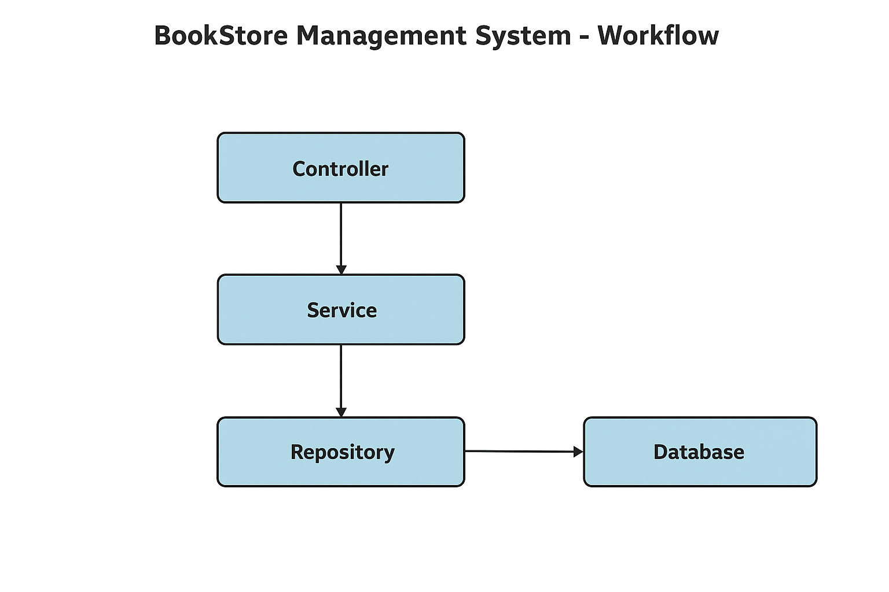

# 📚 BookStore Management System - REST API

A Spring Boot-based Bookstore Management System with Thymeleaf for dynamic views, implementing CRUD operations for books.  
Features include book registration, editing, listing, and personal book collection management, integrated with a layered architecture using service and repository patterns.

---

## 🚀 Features
- **Book Registration:** Add new books with details like title, author, and price.
- **Book Editing:** Update existing book details.
- **Book Listing:** View all available books in the store.
- **Personal Collection:** Maintain a user-specific book collection.
- **Layered Architecture:** Controller → Service → Repository → Database.
- **Thymeleaf Integration:** Dynamic HTML rendering.

---

## 🛠 Tech Stack
- **Backend:** Java, Spring Boot, Spring Data JPA
- **Frontend:** Thymeleaf, HTML, CSS
- **Database:** MySQL
- **Build Tool:** Maven
- **Version Control:** Git, GitHub

---

## 📂 Project Workflow


---

## 📜 How It Works
1. **User (Browser):** Sends requests via the UI.
2. **Controller:** Handles HTTP requests and responses.
3. **Service:** Contains business logic and processing.
4. **Repository:** Communicates with the database layer.
5. **Database:** Stores and retrieves book data.

---

## ⚙️ Installation
```bash
# Clone the repository
git clone https://github.com/Lucky11721/BookStoreManagementSystem_Rest_API_1.git

# Navigate into the project directory
cd BookStoreManagementSystem_Rest_API_1

# Open src/main/resources/application.properties and update the database connection details:
spring.datasource.url=jdbc:mysql://localhost:3306/your_database_name
spring.datasource.username=your_username
spring.datasource.password=your_password
spring.jpa.hibernate.ddl-auto=update

# Ensure MySQL server is running and the database exists.

# Build and run the project
mvn spring-boot:run

